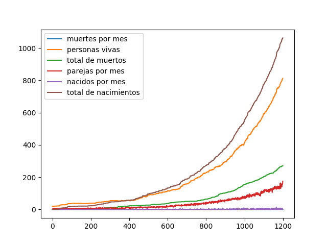
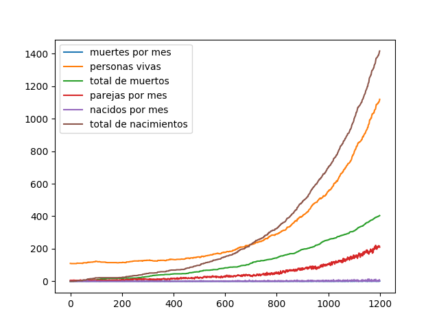
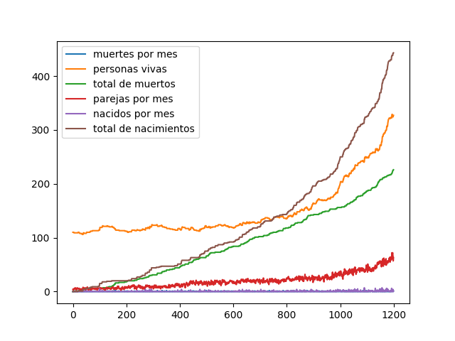
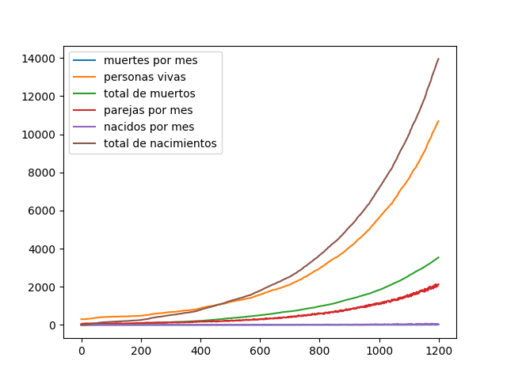

# Informe Escrito

## Autor

| **Nombre y Apellidos** | Grupo |              **Correo**              |              **GitHub**               |
| :--------------------: | :---: | :----------------------------------: | :-----------------------------------: |
|  Ariel Plasencia Díaz  | C-412 | a.plasencia@estudiantes.matcom.uh.cu | [ArielXL](https://github.com/ArielXL) |

## Orientación del Problema

Se desea conocer la evolución de la población de una determinada región. Se conoce que la probabilidad de fallecer de una persona distribuye uniforme y se corresponde, según su edad y sexo, con la siguiente tabla:

|    Edad    | Hombre | Mujeres |
| :--------: | :----: | :-----: |
|  $0 - 12$  | $0.25$ | $0.25$  |
| $12 - 45$  | $0.1$  | $0.15$  |
| $45 - 76$  | $0.3$  | $0.35$  |
| $76 - 125$ | $0.7$  | $0.65$  |

Del mismo modo, se conoce que la probabilidad de que una mujer se embarace es uniforme y está relacionada con la edad:

|    Edad    | Probabilidad de Embarazarse |
| :--------: | :-------------------------: |
| $12 - 15$  |            $0.2$            |
| $15 - 21$  |           $0.45$            |
| $21 - 35$  |            $0.8$            |
| $35 - 45$  |            $0.4$            |
| $45 - 60$  |            $0.2$            |
| $60 - 125$ |           $0.02$            |

Para que una mujer quede embarazada debe tener pareja y no haber tenido el número máximo de hijos que deseaba tener ella o su pareja en ese momento. El número de hijos que cada persona desea tener distribuye uniforme según la tabla siguiente:

| Número de Hijos | Probabilidad |
| :-------------: | :----------: |
|       $1$       |    $0.6$     |
|       $2$       |    $0.75$    |
|       $3$       |    $0.32$    |
|       $4$       |    $0.2$     |
|       $5$       |    $0.1$     |
| $más$ $de$ $5$  |    $0.05$    |

Para que dos personas sean pareja deben estar solas en ese instante y deben desear tener pareja. El desear tener pareja está relacionado con la edad:

|    Edad    | Probabilidad de Querer Pareja |
| :--------: | :---------------------------: |
| $12 - 15$  |             $0.6$             |
| $15 - 21$  |            $0.65$             |
| $21 - 35$  |             $0.8$             |
| $35 - 45$  |             $0.6$             |
| $45 - 60$  |             $0.5$             |
| $60 - 125$ |             $0.2$             |

Cuando dos personas están en pareja la probabilidad de que ocurra una ruptura distribuye uniforme y es de $0.2$. Cuando una persona se separa, o enviuda, necesita estar sola por un período de tiempo que distribuye exponencial con un parámetro que está relacionado con la edad:

|    Edad    |  $\lambda$  |
| :--------: | :---------: |
| $12 - 15$  | $3$ $meses$ |
| $15 - 21$  | $6$ $meses$ |
| $21 - 35$  | $6$ $meses$ |
| $35 - 45$  |  $1$ $año$  |
| $45 - 60$  | $2$ $años$  |
| $60 - 125$ | $4$ $años$  |

Cuando están dadas todas las condiciones y una mujer queda embarazada puede tener o no un embarazo múltiple y esto distribuye uniforme acorde a las probabilidades siguientes:

| Número de Bebés | Probabilidad |
| :-------------: | :----------: |
|       $1$       |    $0.7$     |
|       $2$       |    $0.16$    |
|       $3$       |    $0.08$    |
|       $4$       |    $0.04$    |
|       $5$       |    $0.02$    |

La probabilidad del sexo de cada bebé nacido es uniforme $0.5$. Asumiendo que se tiene una población inicial de $M$ mujeres y $H$ hombres y que cada poblador, en el instante inicial, tiene una edad que distribuye uniforme $U(0,100)$. Realice un proceso de simulación para determinar cómo evoluciona la población en un período de 100 años.

## Principales Ideas Seguidas para la Solución del Problema

Para realizar la simulación deseada definimos objetos y procesos que describen nuestro problema. En nuestra simulación la unidad básica de tiempo es un mes, por lo que en cada mes de la simulación ejecutaremos los procesos definidos para que ejecuten los cambios necesarios en nuestros objetos. El programa consta de dos clases principales `Person` y `Population`, la primera engloba el estado de una persona de nuestro poblado (esta clase nunca es instanciada directamente sino a través de las clases `Woman` y `Man` que heredan de ella), y la segunda contiene todas las personas que conforman nuestro Poblado en Evolución. Durante cada mes de nuestra simulación ejecutaremos $6$ procesos que efectuarán los cambios necesarios en nuestra población. Se profundizará más en cada uno de estos procesos en nuestra siguiente sección.

## Modelo de Simulación de Eventos Discretos

Para la modelación de nuestro problema creamos una clase llamada `Person` que engloba las características consideradas relevantes para nuestra simulación, tenemos también una clase `Population` que contiene a todas las personas de nuestra población y nos permite hacer acciones como añadir personas a nuestra población, saber la cantidad de personas vivas, iterar sobre las personas vivas de la población, entre otras.

Uno de los conceptos principales en nuestra simulación son los procesos que definimos para efectuar cambios sobre nuestra población, estos procesos son: *envejecer*, *emparejar*, *morir*, *embarazar*, *dar a luz*, *romper parejas*. A continuación analizamos cada uno de esos procesos.

### Procesos

#### Envejecer

Este proceso se encarga de aumentar un mes en la edad de todas las personas vivas que pertenecen a la población.

#### Emparejar

Este proceso selecciona a todas las personas vivas que se encuentren solteras (esta búsqueda excluye también a las personas que están recuperándose de una ruptura o están de luto) y de éstas comprueban cuáles desean tener parejas, entre los que queden intenta emparejar hombre con mujeres teniendo en cuenta la diferencia de edad.

#### Morir

Este proceso va por cada una de las personas vivas de la población decidiendo si la persona continúa viva o no, en caso de que la persona muera y tenga pareja coloca a la pareja en estado de luto por un tiempo determinado según una variable aleatoria exponencial con un parámetro $\lambda$ determinado por la edad de la persona.

#### Embarazar

Este proceso recorre las mujeres vivas de la población comprobando cuáles cumplen los requisitos para quedar embarazada (estos requisitos están descritos en la orientación del problema), después de seleccionar las candidatas a embarazarse por cada una genera una variable uniforme para decidir si queda embarazada o no.

#### Dar a luz

Este proceso recorre las mujeres vivas de la población buscando mujeres que fueron embarazadas hace $9$ o más meses (nunca debe cumplirse la condición de mayor estricto porque este proceso se realiza todos los meses por lo que en el noveno mes después del embarazo siempre se comprobará), cada vez que una mujer embarazada hace $9$ es encontrada se define la cantidad de hijos que nacen y esta cantidad de personas es añadida a la población, el sexo de los nuevos individuos es decidido en en método `add_person` de la clase `Population` usando una variable aleatoria uniforme. En este proceso también se actualiza la cantidad de hijos de los padres ya que esta es necesaria, para definir si una mujer puede quedar embarazada o no.

#### Romper parejas

Este proceso recorre los hombre vivos de la población (solo los hombres porque toda pareja tiene un miembro hombre por lo que recorriendo los hombre aseguramos analizar todas las parejas) que tengan pareja y decide si la relación termina o no, en caso de que la relación termine coloca a ambos miembros de la pareja en estado de recuperación por un tiempo determinado según una variable aleatoria exponencial con un parámetro $\lambda$ definido por la edad de cada uno de ellos.

### Pseudocódigo del loop principal

Después de analizar los procesos que ocurren en nuestra simulación estamos en condiciones de mostrar un pseudocódigo de nuestro loop principal.

```python
while True:
    # aumentamos en un mes la cantidad de personas vivas
    envejecer()
    # creamos una copia de la lista de procesos
    pro = [ p for p in process ]
    # seleccionamos los procesos en orden aleatorio y los ejecutamos
    while len(pro) > 0:
        idx = random(0, len(pro) - 1)
        pro.pop(idx)
    # avanzamos en un mes
    avanzar()
```

## Consideraciones Obtenidas a partir de las Simulaciones

Luego de realizar distintas simulaciones con la orientación inicial se pueden realizar distintas observaciones:

1. Teniendo en cuenta que el proceso de *Morir* es ejecutado todos los meses las probabilidades de fallecer propuestas en la orden del ejercicio son muy altas lo que provocaba que en la simulación la
   población muriera muy rápido, para solucionar esto se decidió cambiar estas probabilidades de la siguiente forma: si la probabilidad del intervalo $X − Y$ es $Z$ entonces la nueva probabilidad será $\frac{Z}{\abs{Y − X} ∗ 12}$. Esto fue decidido teniendo en cuenta que todos los meses se efectuará esta comprobación y la probabilidad de morir en el intervalo será la suma de las probabilidades de morir en cada mes.
2. Realizando un análisis parecido al anterior realizamos un cambio parecido con la probabilidad de una mujer de quedar embarazada debido a que la población crecía demasiado rápido por la cantidad de bebés que nacían.
3. En la orden se orientaba que el tiempo que una persona necesitaba para recuperarse de una ruptura o del luto era una variable aleatoria exponencial de parámetro $\lambda$ donde se nos daba el parámetro
   para cada edad, pero usando estos parámetros los valores esperados eran hasta menores que un mes y disminuían con el aumento de la edad, esto no vimos que fuera consecuente con el comportamiento real y decidimos tomar el valor que se nos daba como valor esperado por tanto $\lambda$ será $\frac{1}{V}$ donde $V$ es el valor ofrecido en la orientación para cada intervalo de edad.
4. En la tabla que daba las probabilidades para definir cuántos niños van a nacer se realizó un cambio para que las probabilidades sumaran $1$.
5. La población crece de manera general, el crecimiento más rápido se ve cuando las cantidades iniciales de hombres y mujeres son cercanas.

## Resultados

| Cantidad de Mujeres | Cantidad de Hombres | Años  |                 Gráfico                 |
| :-----------------: | :-----------------: | ----- | :-------------------------------------: |
|        $10$         |        $10$         | $100$ |    |
|        $10$         |        $100$        | $100$ |   |
|        $100$        |        $10$         | $100$ |   |
|        $150$        |        $150$        | $100$ |  |

## Enlace a GitHub

Para acceder al enlace en GitHub pulse [aquí](https://github.com/ArielXL/discrete-events).
